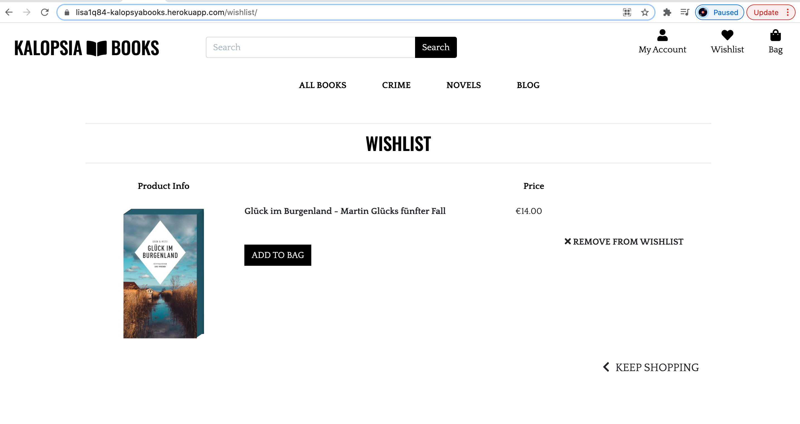

# Kalopsia Books MS4 - Testing Details

## **How did I test?**

[W3C Markup Validation Service](https://validator.w3.org/)

-   W3C Markup Validation Service has been used for the testing of the  **HTML** and **CSS** and  **no error**  was found. The result can be seen in  [\[This File\]](https://github.com/lisa1Q84/kalopsia_lens/tree/main/media/HTML_Validation) 

-   W3C CSS Validation service has been used to check the  **CSS**  of the project and  **no error**  was found. The result can be seen here.  [\[CSS Test\]](https://github.com/lisa1Q84/kalopsia_lens/tree/main/media/CSS_Validation) 

[Python validator | PEP8](http://pep8online.com/):
 - I copy pasted all my code into the pep8 checking tool and everything came back "all right".
 - There were some errors in the settings.py file (lines too long) but it was in code not written by myself and therefore, I learned from Slack, should not affect my project. 

[Lighthouse Google Developer Tools](https://developers.google.com/web/tools/lighthouse)
- No errors and a mediocre score with plenty room for improvement:

The Project was tested for Browser compatibility on multiple versions of IE, Chrome and Safari

It was found that "the CSS `transform:` property is not supported by some older browsers" and "The `display: flex` CSS property does not work correctly in some browsers."

Other than that it was suggested to make improvements in the area of Search Engine Optimisation by adding more links and headlines and offering a HTML site map. 

**Client Stories Testing**

Testing client stories from UX part of README.md

As a user of the site:

**1. I want to understand the website's purpose**

	Clear mission statement on index page and introduction to the author. Functional menu to help user navigate to different parts of the website to start shopping. 

	
**2. I want to be easily able to view a list of all books and use filters**

Filtering option works and allows user to filter the books by category, name and price.  Able to reset filter to see everything again. 

**3.  I want to be able to view specific product details**

When clicking on a product, the user gets to the 'product detail' page with the title, photo, book info.

**4. I want to be able to easily select a product, the quantity and add it to my shopping cart.**

On the product details page, the user has the option to select the quantity and add the product to their shopping bag.

**5. I want to be able to save my shipping information when paying to not have to re-enter all my info the next time I make a purchase.**

When paying on the checkout page, the user can tick a box to save his information. The information can then be found in the profile section of the website along with the clients order history. 

**6. I want to be able to edit my shipping information in my profile in case something changes.** 

In the profile section, the shipping info can be edited.

**7. I want to receive a confirmation when adding to /updating something in my cart, to my wishlist and when making a purchase.** 

When adding a product to the cart/ wishlist, updating the quantity, deleting it there is a little confirmation window popping up on the top-right side of the screen. 

After ordering the user received a email confirmation with the order number. 

**8. I want to be able to save the products I am interested in (but have no intention to buy just yet) for later.**

It is possible for users to add products from the Product Detail site to a wishlist. From the wishlist, the user can later go back to the product detail page, select the quantity and add them to the shopping bag. 

As the site owner:

**1. I want the website to provide a platform for users to purchase books.**

Books can be easily found and purchased on the website. The process from adding the products to the shopping bag to the checkout is simple and fast.

**2. I want to be able to add/edit/delete products**

The admin can edit/ delete products on the 'all products' site as well as on the 'product details' site through buttons. When clicking on 'delete' a window pops up to make sure the admin really wants to delete the product.
On the profile -> product management site the admin can easily add products to the shop. 
 
3. I want to be able to share news/ releases with my audience on a blog and to be able to edit/delete my blog posts

Admins can create blog posts in the blog post section of the website as well as edit and delete them.

    

**Manual Testing of all elements and functionality of every page.**

-   **Navigation Bar**
    
    1.  Check if the  **navbar**  is situated always on top and transforms into a collapsible menu when on m and s screens.

-   **Sections**

    1.   Click The  **MENU LINKS** and check if it brings the user to the intended page and all the links are working.
    2.  Fill the  **Login/Register**  forms and check if it works and if the user gets redirected if the username already exists or the login data is wrong.
    3.  Visit the  **Profile **, and check if the shipping information and order history are displayed (if existing) and if so, check if they can be updated. 
    4.  Try to  **Add Product**, from an admin accound and check if the validation works and if products are successfully added to the DB.
    5.  Check if the  **Logout** works and if the user gets redirected to the register/login page.
    6.  Click the  **Product**,  and see if they direct the user to the details site of the correct book.
    7.  Go through the **Checkout Process**, to see if orders can be made as intended (with the test credit card details) and to check if the confirmation email happens. 

  
-   **Content**
    
    1.  Check the alignment of content on mobile 
    2.  Check spelling by online spelling and grammar checker  [Grammarly.com](https://app.grammarly.com/). Few spelling mistakes were found, which were corrected.
    

**Project Barrier**

-   Unfortunately when first submitting my project there was a problem with the checkout process with the user not being able to complete the purchase. There were also several PEP8 errors.
I was since able to correct these and I greatly expended my testing and my user stories in order to make sure the functionality of the website is granted and the there are no broken links. 

-   I had several problems with my deployment to Heroku but due to the help of tutor support I was able to go back in my version history to when things still worked and to find the error related to my code in the bag context file . 

- I exposed my secret keys and aws info several times and learned a lot by going through the changing process to ensure the website is safe and nothing is exposed.

**Bug report**

-  While testing my site with the Google Developer Tools I came across a strange error I was not able to resolve. Sometimes when checking the site on smaller devices, a horizontal scroll bar appeared on the bottom of the page. When I tried to reload the page and later to reproduce this error, there was suddenly no scrollbar and the pages had no scrollbar problems on smaller devices. 
- When adding a book through the product management section negative numbers can be the input. Due to time constraints I was unable to fix this.